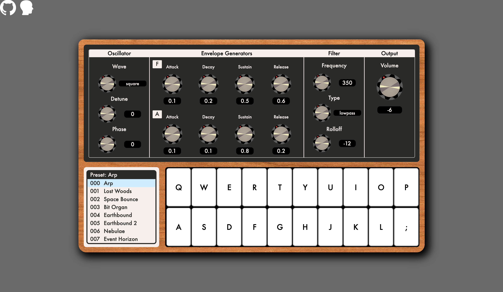

# MonoSynth

# Welcome! What is this?
MonoSynth is a free, easy to use [monophonic synthesizer](https://en.wikipedia.org/wiki/Polyphony_and_monophony_in_instruments). The frontend was developed using React and the audio was generated using [Tone.js](https://tonejs.github.io/). This project was a way for me to learn sound synthesis and React at the same time. It still has some problems so whenever the sound starts glitching, refresh the page and you should be good to go.

# Features

### Preset Menu

 
Choose from multiple unique presets using the menu in the bottom left corner.

### Custom Settings

 
Once you find a preset you enjoy, change a few parameters to customize it.

### Playable Keyboard

 
After everything is ready, click on one of the keys and use your keyboard to play.

# Contributing
There are many ways to contribute to MonoSynth. First off I have no idea how to manage garbage collection with Tone.js. If someone could find a way to delete old Tone.Synth obects that would be greatly appreciated. Next, whenever a setting is changed the keyboard / tone is not reloaded. This seems like an easy fix and great starting point to help. Thank you for taking an interest in this project.

# Referances and Inspiration
* [Tone.js](https://tonejs.github.io/)
* [Moog Sub 37](https://www.moogmusic.com/products/sub-37)
* [Knob / Dial by Daniel Subat](https://codepen.io/bbx/pen/QBKYOy)
